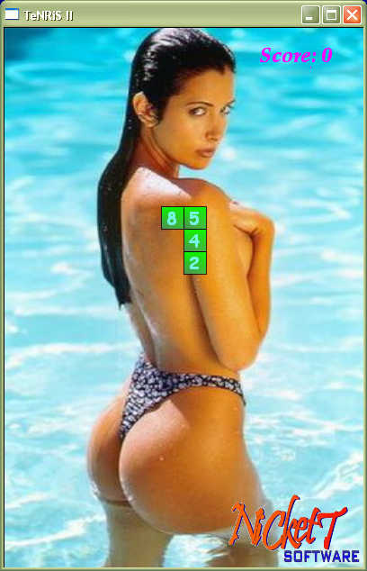

# TeNRiS II



**Tetris with Numbers** - OpenGL version with 3D sound.


Original game concept from 2007.


## Game Rules

Instead of traditional Tetris blocks, pieces contain numbers (1-9). When two adjacent numbers sum to 10, they disappear. Freed blocks continue falling, creating chain reactions.

**Examples:**
- 3 + 7 = 10 → blocks disappear
- 4 + 6 = 10 → blocks disappear  
- 1 + 9 = 10 → blocks disappear

## Features

- **3D Positional Audio** - Sound effects positioned in 3D space
- **OpenGL Graphics** - Hardware-accelerated rendering via DGLEngine
- **Chain Reactions** - Falling blocks create cascading combinations
- **Score System** - Points for each combination cleared

## Controls

- **Arrow Keys** - Move pieces
- **Up Arrow** - Rotate piece
- **Space** - Drop quickly
- **Down Arrow** - Accelerated drop
- **R** - Restart game
- **S** - Toggle music
- **F1** - Help
- **Esc** - Quit

## System Requirements

**Python version (Windows & macOS):**
- Python 3.10+
- pygame-ce (`pip install pygame-ce`)

**Pascal version (Windows only):**
- Windows XP or later
- DirectX 8.0c compatible graphics
- Sound card for 3D audio

## Building & Running

### Python — Windows & macOS

```bash
# Install dependencies
pip install pygame-ce

# Run directly
python tenris.py

# Build standalone executable
pip install pyinstaller Pillow
python create_installer.py
```

The standalone `.exe` (Windows) or app (macOS) will be created in the `dist/` folder.

### Free Pascal Build — Windows only

Requires [Free Pascal Compiler](https://www.freepascal.org/):

```bat
build.bat 

# or manually
fpc -Mdelphi -Twin32 -O3 -WG -Fu. TeNRiS.dpr
```

## License

This project is licensed under the GPL-3.0 License. See the LICENSE file for details.

---

*Original game design and implementation © 2007*
